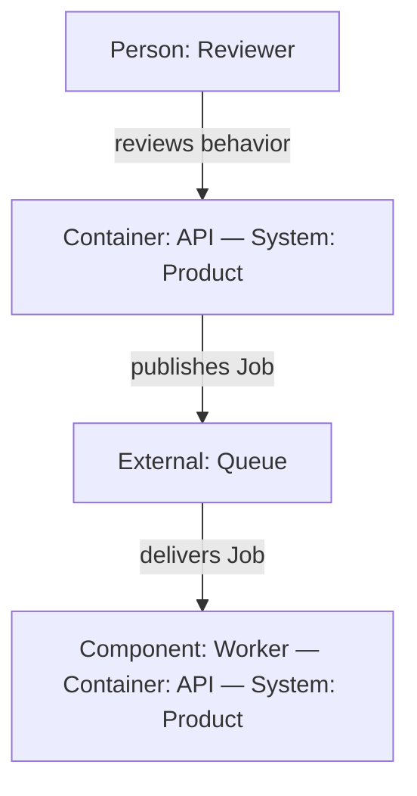

# Pi Mermaid TUI

Render Mermaid diagrams as terminal-native Unicode directly in Pi tool results. The assistant calls the normal `render_mermaid` Pi tool; no browser, image protocol, or additional Herdr pane is involved.

## Install

```sh
pi install npm:@ramtinj95/pi-mermaid-tui
```

Reload or restart Pi after installation. The model can then call `render_mermaid` whenever a diagram would clarify its response.

## Supported diagrams

- `graph` and `flowchart`, including subgraphs
- `sequenceDiagram`
- `stateDiagram`
- `classDiagram`
- `erDiagram`

This is a terminal-oriented subset of Mermaid rather than a complete Mermaid.js implementation. Unsupported diagram families and syntax use the upstream renderer's framed-source fallback. Diagrams that cannot fit the available width may also fall back to source.

## Orientation

Orientation stays part of the Mermaid source, so each diagram can choose the
layout that best fits its content:

- Flowcharts: `flowchart TB` (vertical), `flowchart LR` (horizontal), plus
  `BT` and `RL` for the reverse directions.
- State and class diagrams: add `direction TB` or `direction LR` after the
  diagram header.
- ER diagrams currently render vertically. Sequence diagrams keep their
  natural horizontal participant layout.

The tool guidance tells the model to honor explicit orientation requests. If
no orientation is requested, it prefers vertical layouts for branching or
potentially wide flows and horizontal layouts for short linear flows. There is
no package configuration file or forced global orientation.

## Code-change annotations

Flowchart and state nodes using the semantic Mermaid classes `added`,
`removed`, `changed`, and `same` are mapped to the active Pi theme. Inline
assignments such as `A[New step]:::added` and `class A,B changed` are supported.

For flowchart edges, `linkStyle` declarations using the GitHub diff palette are
mapped to the same semantic colors:

- `stroke:#2ea043` — added
- `stroke:#cf222e` — removed
- `stroke:#bf8700` — changed
- `stroke:#8c959f` — unchanged

This is a narrow semantic profile, not general Mermaid CSS support. Other
`classDef`, `style`, and `linkStyle` colors remain visually ignored. Use dotted
edge syntax and textual labels when meaning must also survive uncolored output.

## C4-style architecture views

C4-style Context, Container, and Component views are supported as an authoring
profile built from ordinary, flat Mermaid flowcharts. Prefix labels so their
architectural role survives in plain terminal output, and append ownership to
internal labels when a boundary matters, for example
`Component: Worker — Container: API — System: Product`:

| Prefix | Meaning |
| --- | --- |
| `Person:` | Human actor or role |
| `System:` | Software system or system boundary |
| `Container:` | Deployable application, service, or data store |
| `Component:` | Major runtime component or module |
| `External:` | Dependency outside the changed system |

Label every relationship with its intent, protocol, or data shape. For code
changes, show only the changed elements and their directly affected neighbors;
5–15 nodes and at most two nested boundaries usually remain readable.



Native Mermaid C4 syntax is not supported, including `C4Context`,
`C4Container`, `C4Component`, `C4Dynamic`, and `C4Deployment`. The profile also
omits C4 sprites, icons, tags, and per-boundary layout directives; use one
global flowchart direction and textual labels instead. Do not use subgraphs as
C4 boundaries: the terminal renderer currently routes cross-subgraph
relationships to the boundary frame rather than the named node.

## How it works

The extension registers `render_mermaid` through Pi's public extension API. A tool call validates the Mermaid source and lazily loads the bundled WebAssembly renderer. Its semantic output classes are mapped to the active Pi theme by a custom result component, which rerenders at the current terminal width.

Tool calls behave normally: rendering a diagram does not terminate the model turn. The model can continue after a diagram, so skills and longer workflows can use diagrams as one part of their output. Expanding a completed tool result shows the original Mermaid source.

This package intentionally does not patch Pi's internal Markdown renderer. Ordinary fenced Mermaid blocks remain source code unless the model calls `render_mermaid`; in return, the integration stays on Pi's public extension surface.

In non-TUI modes, the tool returns plain Unicode text instead of a custom component.

## Renderer source

The repository includes the complete pinned Rust source used to build `grok-mermaid.wasm` under [`grok-mermaid/`](grok-mermaid/). It is Simon Willison's WebAssembly extraction of the Mermaid terminal renderer from xAI's open-source Grok Build project.

See [`THIRD_PARTY.md`](THIRD_PARTY.md) for exact revisions, checksums, licenses, and attribution.

## Development

```sh
npm install
npm run check
```

Terminal visual regressions are stored as plain Unicode fixtures under
`test/fixtures/terminal-goldens/`. Normal test runs only compare them. To
intentionally regenerate the fixtures after a renderer change, run:

```sh
npm run test:update-goldens
```

Review the resulting text diff before committing it; the command does not
approve visual changes.

The renderer build additionally requires the `wasm32-unknown-unknown` Rust target and `wasm-opt` from Binaryen:

```sh
rustup target add wasm32-unknown-unknown
./grok-mermaid/build_wasm.sh
shasum -a 256 grok-mermaid.wasm
```
